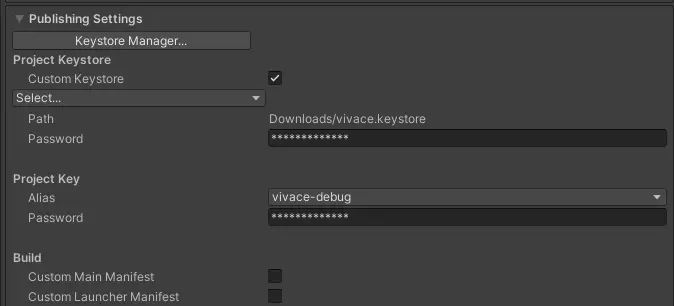

# 環境構築

## 1. CONFIG値を設定する
`.env` ファイルをルートディレクトリ（`vivace.sln`と同じ階層）に設置します。

## 2. Firebaseの設定ファイルを読み込む
配布された `google-services.json` と `GoogleService-Info.plist` を
`Assets` フォルダ内にドラッグ&ドロップします。

## オプション: Androidアプリをビルドする場合
`File > Build Settings > Player Settings` を開き、
`Player > Android > Publishing Settings > Project KeyStore` を入力する。

